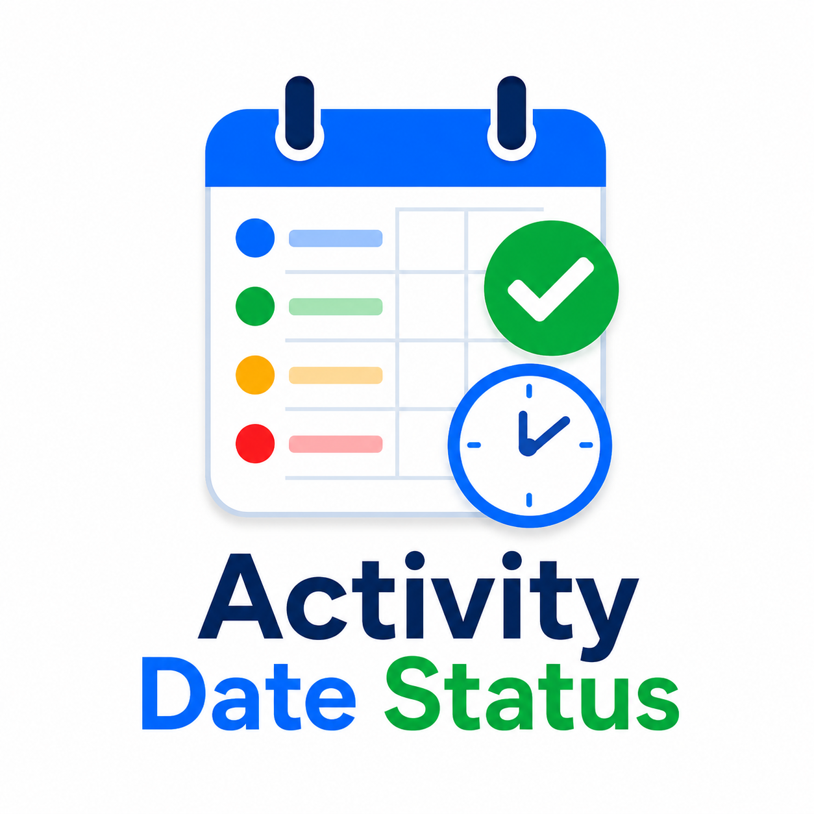

# Activity Date Status

<p align="center">
  
</p>

**Activity Date Status** (`local_activitydatestatus`) is a local plugin for Moodle LMS that turns native activity dates into clearer exact-date and relative-status information on the course page, while leaving scheduling, access rules, and user-specific overrides under Moodle's control.

> **Public release:** 1.0.0  
> **Moodle:** 4.5–5.2  
> **License:** GNU GPL v3 or later

Documentation: **English** | [Português (Brasil)](docs/README.pt-BR.md) | [Español](docs/README.es.md)

## Why this plugin?

Moodle already provides activity dates. Activity Date Status does not replace Moodle's scheduling logic. Instead, it gives teachers per-activity control over how those dates are presented and adds a relative status such as “tomorrow”, “in 4 hours”, or “yesterday”, with semantic Bootstrap 5 visual states.

## Main features

- Per-activity enable/disable control.
- Three explicit display modes:
  - **Dates only**;
  - **Status only**;
  - **Dates + status** (recommended).
- Two status appearances:
  - **Bootstrap 5 badge** (recommended);
  - **Coloured text with icon**.
- Per-activity warning threshold, default **48 hours**.
- Optional critical threshold, default **12 hours**.
- Site-wide defaults that teachers can override in each activity.
- Standard Bootstrap 5 semantic states:
  - `info` — upcoming/opening;
  - `success` — available with no immediate urgency;
  - `warning` — deadline approaching or overdue soft deadline;
  - `danger` — critical proximity or closed state;
  - `secondary` — neutral/unclassified date semantics.
- User-specific dates are obtained from Moodle core.
- Fail-safe behavior: Moodle's native date block is hidden only after plugin content has been rendered successfully.
- No external services or runtime dependencies.

## How it works

The plugin uses Moodle's native API:

```php
\core\activity_dates::get_dates_for_module($cm, $userid);
```

Moodle remains the single source of truth. The plugin stores only presentation preferences for each course module and does **not** duplicate opening dates, closing dates, due dates, or access rules.

## Teacher controls

When editing an activity or resource, teachers can configure:

- **Display date and deadline indicator**;
- **Display mode**: Dates only, Status only, or Dates + status;
- **Status appearance**: Bootstrap 5 badge or coloured text with icon;
- **Highlight deadline proximity** in hours;
- **Highlight critical urgency** in hours.

Site administrators can define defaults under:

**Site administration → Plugins → Local plugins → Activity Date Status**

These are defaults only. Teachers retain control in each activity.

## Installation

### From ZIP

1. Download the release ZIP.
2. In Moodle, go to **Site administration → Plugins → Install plugins**.
3. Upload the ZIP and complete validation.
4. Visit **Site administration → Notifications** to finish installation.

### From Git

Clone the repository into `local/activitydatestatus`:

```bash
git clone <repository-url> local/activitydatestatus
```

Then visit **Site administration → Notifications**.

## Compatibility

The public 1.0.0 release supports Moodle **4.5 through 5.2**. GitHub Actions validates supported branches with Moodle Plugin CI.

The plugin works with activities and resources that expose dates through Moodle's `core\\activity_dates` API. If a module does not expose activity dates, the plugin displays nothing for that module.

## Accessibility

- Status is always communicated with text, not color alone.
- Icons are decorative and hidden from assistive technologies.
- Bootstrap semantic colors are used consistently.
- Moodle/theme typography is inherited rather than replaced.

## Privacy

The plugin does not store personal data. It stores presentation settings associated with course-module IDs. Activity dates remain in the original Moodle activity/module data.

## Languages

The GitHub distribution includes:

- English (`en`);
- Brazilian Portuguese (`pt_br`);
- Spanish (`es`).

For Moodle Marketplace submission, see [Marketplace submission notes](docs/MARKETPLACE.md).

## Development

The repository includes Moodle Plugin CI configuration for automated validation. See [CONTRIBUTING.md](CONTRIBUTING.md).

## License

GNU General Public License v3 or later. See [LICENSE](LICENSE).
